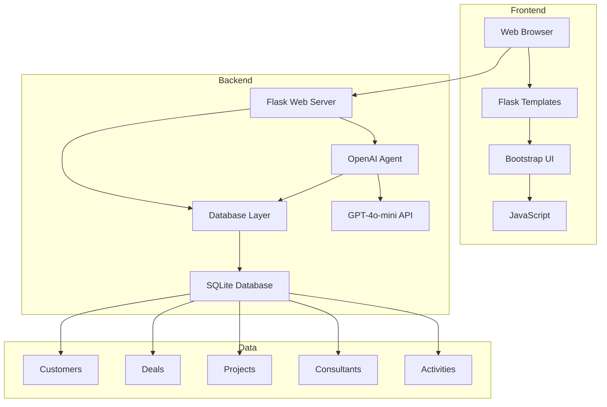
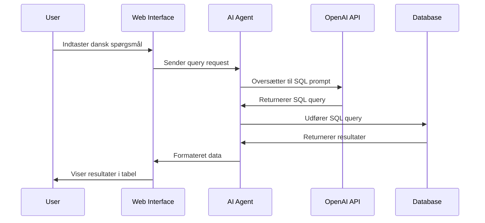
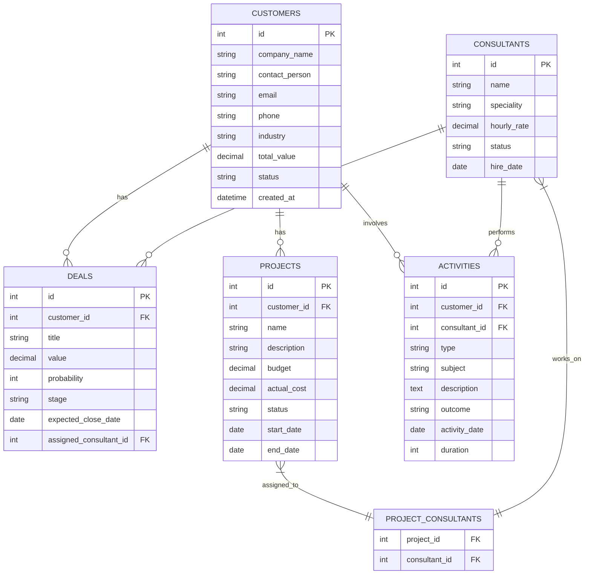

# Support Solutions CRM System

<div align="center">


*Et intelligent Customer Relationship Management system med AI-drevne SQL queries og moderne web interface*

</div>

## 📋 Oversigt

Support Solutions CRM er et moderne, AI-drevet CRM system udviklet til danske IT-konsulentvirksomheder. Systemet kombinerer traditionel CRM funktionalitet med OpenAI's GPT-4o-mini til intelligent SQL query generering på dansk.

### ✨ Hovedfunktioner

- 🤖 **AI-drevne SQL Queries** - Stil spørgsmål på dansk og få automatisk genereret SQL
- 👥 **Kundestyring** - Komplet oversigt over kunder og kontaktpersoner
- 💼 **Deal Pipeline** - Salgspipeline med sandsynlighedsberegning
- 📊 **Projektstyring** - Budget sporing og team management
- 👨‍💼 **Konsulent Management** - Timepriser og specialer
- 📅 **Aktivitetslog** - Sporing af alle kundeinteraktioner
- 🎨 **Support Solutions Branding** - Tilpasset design med virksomhedens farvepalette
- ⚡ **Loading Animationer** - Flot wave loading animation under query processing
- 🔽 **Collapsible Sektioner** - Clean UI med CTA buttons for bedre brugeroplevelse

## 🏗️ Systemarkitektur



## 🔄 AI Query Process Flow



## 📁 Projektstruktur

```
sql-agent/
├── app/
│   ├── __init__.py
│   ├── agent.py          # AI SQL agent
│   ├── config.py         # Konfiguration
│   ├── db.py            # Database forbindelse
│   ├── demo_data.sql    # CRM demo data
│   └── prompt.py        # AI prompts
├── data/
│   └── example.db       # SQLite database
├── static/
│   └── style.css        # Support Solutions styling
├── templates/
│   ├── index.html       # Dashboard
│   ├── customers.html   # Kunde oversigt
│   ├── deals.html       # Deal pipeline
│   ├── projects.html    # Projekt styring
│   ├── consultants.html # Konsulent oversigt
│   └── activities.html  # Aktivitets log
├── web.py              # Flask web server
├── run.py              # Entry point
└── requirements.txt    # Dependencies
```

## 🚀 Installation & Opsætning

### Forudsætninger
- Python 3.11+
- OpenAI API key (valgfrit - systemet kører uden AI funktionalitet)

### 1. Clone Repository
```bash
git clone <repository-url>
cd sql-agent
```

### 2. Opret Virtual Environment
```bash
python -m venv .venv
source .venv/bin/activate  # macOS/Linux
# eller
.venv\Scripts\activate     # Windows
```

### 3. Installer Dependencies
```bash
pip install -r requirements.txt
```

### 4. 🔐 Sikkerhedsopsætning (VIGTIGT!)

Opret en `.env` fil i roden af projektet:

```bash
# .env (DENNE FIL MÅ ALDRIG COMMITTES!)
OPENAI_API_KEY=your-openai-api-key-here
```

**⚠️ SIKKERHEDSADVARSEL:** 
- `.env` filen indeholder følsomme API keys
- Den er allerede tilføjet til `.gitignore`
- Commit ALDRIG denne fil til version control
- Brug environment variabler i produktion

### 5. Start Systemet
```bash
python web.py
```

Åbn din browser på: `http://localhost:5001`

## 🛡️ Sikkerhedsvejledning

### 🚨 Før du gør repository offentlig

1. **Tjek .gitignore**
   ```gitignore
   .env
   .env.local
   .env.production
   *.env
   __pycache__/
   .venv/
   *.pyc
   .DS_Store
   ```

2. **Verificer ingen hemmeligheder er committed**
   ```bash
   git log --all --full-history -- .env
   git log -p | grep -i "api_key\|password\|secret"
   ```

3. **Opret .env.example**
   ```bash
   # .env.example (Dette kan committes)
   OPENAI_API_KEY=your-openai-api-key-here
   ```

4. **Rens git history hvis nødvendigt**
   ```bash
   # Hvis du allerede har committed .env filen
   git filter-branch --force --index-filter \
   'git rm --cached --ignore-unmatch .env' \
   --prune-empty --tag-name-filter cat -- --all
   ```

### 🔒 Produktionssikkerhed

- **Environment Variables**: Brug cloud provider's secret management
- **Database**: Skift til PostgreSQL/MySQL i produktion
- **HTTPS**: Aktivér SSL certifikater
- **Authentication**: Implementer bruger login system
- **Rate Limiting**: Begræns API requests
- **Input Validation**: Validér alle brugerinputs

## 📊 CRM Data Model



## 🎯 Brug af Systemet

### 🎨 Moderne UI/UX Features

**Collapsible Sektioner:**
- 💡 **Query Eksempler** - CTA button viser/skjuler AI forslag for cleaner interface
- ❓ **CRM Forespørgsel** - Kollapsbar visning af brugerens spørgsmål
- 🔧 **SQL Query** - Tekniske detaljer kun synlige ved behov

**Loading Animation:**
- ⚡ **Wave Loading** - Flot animeret loading under AI processing
- 🧠 **Smart Feedback** - "AI analyserer dit CRM spørgsmål..." besked

### AI Query Eksempler
**Geografisk intelligens:**
- "Kunder fra Jylland" → Automatisk konverteret til postnummer 6000-9999
- "Finanskunder i København" → Kombinerer branche og geografisk søgning
- "IT virksomheder i Midtjylland" → Forstår både branche og region

**Smart forståelse:**
- "Store kunder" → Sorteret efter total_value DESC
- "Nye kunder" → customer_since >= 12 måneder siden
- "Hot prospects" → probability >= 75% AND aktiv stage
- "Projekter over budget" → actual_cost > budget

### Navigation
- **Dashboard**: AI queries og KPI oversigt
- **Kunder**: Kundestyring med filtrering
- **Deals**: Salgspipeline med sandsynlighed
- **Projekter**: Budget og fremskridt sporing
- **Konsulenter**: Team oversigt med specialer
- **Aktiviteter**: Komplet aktivitetslog

## 🤝 Bidrag til Projektet

1. Fork repository
2. Opret feature branch (`git checkout -b feature/amazing-feature`)
3. Commit dine ændringer (`git commit -m 'Add amazing feature'`)
4. Push til branch (`git push origin feature/amazing-feature`)
5. Åbn Pull Request

## 📄 Licens

Dette projekt er licenseret under MIT License - se [LICENSE](LICENSE) filen for detaljer.

## 👨‍💻 Udviklet af

**Hidesh Kumar**

---

<div align="center">

**⭐ Hvis du finder dette projekt nyttigt, giv det en stjerne!**

</div>
